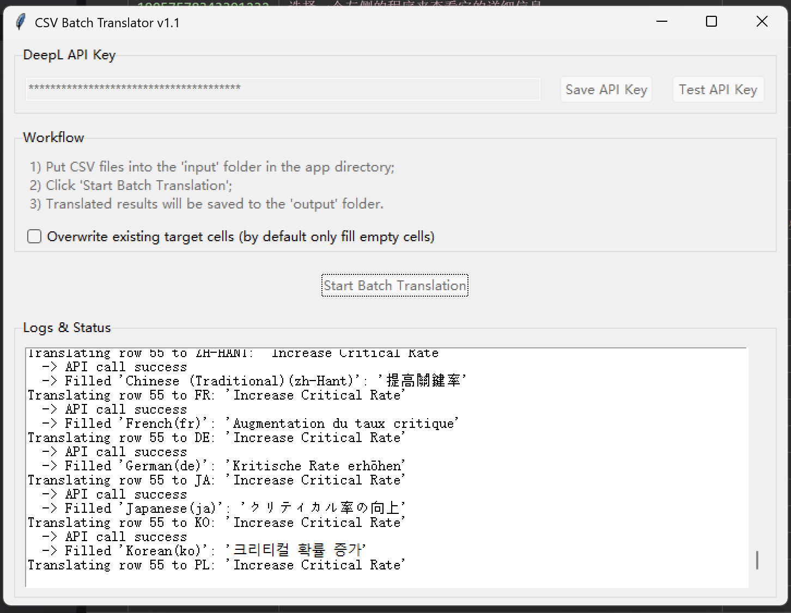

# CSV 批量翻译工具 (CSV Translator)

[English Version](#-english-version)

这是一个使用 Python 和 DeepL API 开发的桌面小工具，**专为翻译 Unity Localization 插件导出的 CSV 表格而设计**。它可以快速、批量地将指定列从源语言翻译成多种目标语言，极大简化多语言本地化流程。

Use deepL API to translate CSV table that outputed from Unity Localization.



---

### 👋 首次发布说明

你好！我是**老白**，一名游戏开发者。这是我第一次公开发布个人项目，主要目的是为了方便自己和同样有需求的朋友。

项目中可能存在一些未被发现的 Bug 或疏漏之处，非常欢迎你通过 [Issues](https://github.com/siyan12/UnityLocalizationCSVDeepLTranslater/issues) 提出反馈和建议，帮助我把这个小工具做得更好！

### 👨‍💻 关于我

-   **作者**: 老白
-   **身份**: 独立游戏开发者
-   **工作室**: LauNewBee
-   **我的作品**: [欢迎访问我的 Steam 开发者页面](https://store.steampowered.com/developer/LauNewBee)

---

## ✨ 功能特性

-   **专为 Unity 设计**：完美适配 Unity Localization 插件导出的 CSV 格式。
-   **图形化界面**：简洁直观的图形界面，无需命令行操作。
-   **批量翻译**：一次性将 CSV 文件中的文本翻译成多种指定语言。
-   **配置简单**：只需在 `config.ini` 文件中填入你的 DeepL API Key 即可使用。
-   **跨平台**：已打包为 Windows `exe` 文件，开箱即用。

---

## 🚀 快速开始 (普通用户)

1.  **下载与解压**
    -   前往本项目的 [Releases 页面](https://github.com/siyan12/UnityLocalizationCSVDeepLTranslater/releases)。
    -   下载最新的 `CSVTranslator-vX.X.X.zip` 压缩包并解压。

2.  **准备文件**
    -   将从 Unity 导出的 `.csv` 文件放入 `input` 文件夹。

3.  **运行与翻译**
    -   双击运行 `CSVTranslator.exe`。
    -   在程序界面的 **API Key 输入框**中填入你的 DeepL API Key（会自动保存，下次无需重复输入）。
    -   选择源语言、目标语言，然后点击“开始翻译”。
    -   翻译完成后，结果会保存在 `output` 文件夹中。

---

## 📂 文件结构说明

```
CSVtranslator-run/
├── CSVTranslator.exe       # 主程序
├── config.ini              # 配置文件 (用于自动保存 API Key)
├── input/                  # 存放待翻译的 CSV 文件
│   └── example.csv
└── output/                 # 存放翻译后的 CSV 文件
```

---

## ⚠️ 注意事项

-   **API Key**：请务必保管好你的 DeepL API Key，不要泄露或上传到公共仓库。`.gitignore` 文件已配置忽略 `config.ini`。
-   **费用**：DeepL API 的免费额度有限，请注意使用量，避免产生不必要的费用。
-   **CSV 格式**：请确保你的 CSV 文件来自 Unity Localization 插件，并包含 `Key` 列和源语言列（例如 `en`）。

---
---

# 🇬🇧 English Version

This is a desktop tool developed with Python and the DeepL API, **specifically designed for translating CSV files exported from the Unity Localization package**. It can quickly batch-translate specific columns from a source language to multiple target languages, greatly simplifying the localization workflow.

Use deepL API to translate CSV table that outputed from Unity Localization.


---

### 👋 First Release Note

Hi there! I'm **Lao Bai**, a game developer. This is the first personal project I've ever released publicly. My main goal was to create a handy tool for myself and other developers with similar needs.

There might be some undiscovered bugs or oversights. I would be very grateful if you could provide feedback and suggestions via the [Issues](https://github.com/siyan12/UnityLocalizationCSVDeepLTranslater/issues) page to help me improve it!

### 👨‍💻 About Me

-   **Author**: Bai
-   **Role**: Indie Game Developer
-   **Studio**: LauNewBee
-   **My Work**: [Check out my Steam Developer Page](https://store.steampowered.com/developer/LauNewBee)

---

## ✨ Features

-   **Designed for Unity**: Perfectly compatible with the CSV format exported by the Unity Localization package.
-   **GUI**: Simple and intuitive graphical user interface, no command line needed.
-   **Batch Translation**: Translate text in a CSV file into multiple target languages at once.
-   **Easy Configuration**: Simply enter your DeepL API Key in the `config.ini` file.
-   **Cross-Platform**: Packaged as a Windows `exe` for out-of-the-box use.

---

## 🚀 Quick Start (For Users)

1.  **Download and Unzip**
    -   Go to the [Releases page](https://github.com/siyan12/UnityLocalizationCSVDeepLTranslater/releases) of this project.
    -   Download and unzip the latest `CSVTranslator-vX.X.X.zip` archive.

2.  **Prepare Files**
    -   Place the `.csv` file exported from Unity into the `input` folder.

3.  **Run and Translate**
    -   Double-click `CSVTranslator.exe` to run it.
    -   Enter your DeepL API Key in the **API Key input field** in the UI (it will be saved automatically for future use).
    -   Select the source and target languages, then click "Start Translation."
    -   The translated file will be saved in the `output` folder.

---

## 📂 File Structure

```
CSVtranslator-run/
├── CSVTranslator.exe       # Main executable
├── config.ini              # Configuration file (stores the API Key automatically)
├── input/                  # Place CSV files to be translated here
│   └── example.csv
└── output/                 # Translated CSV files will be saved here
```

---

## ⚠️ Important Notes

-   **API Key**: Please keep your DeepL API Key secure. Do not expose it or commit it to a public repository. The `config.ini` file is already ignored by `.gitignore`.
-   **Costs**: The DeepL API has a limited free tier. Be mindful of your usage to avoid unexpected charges.
-   **CSV Format**: Ensure your CSV file is from the Unity Localization package and contains a `Key` column and a source language column (e.g., `en`).