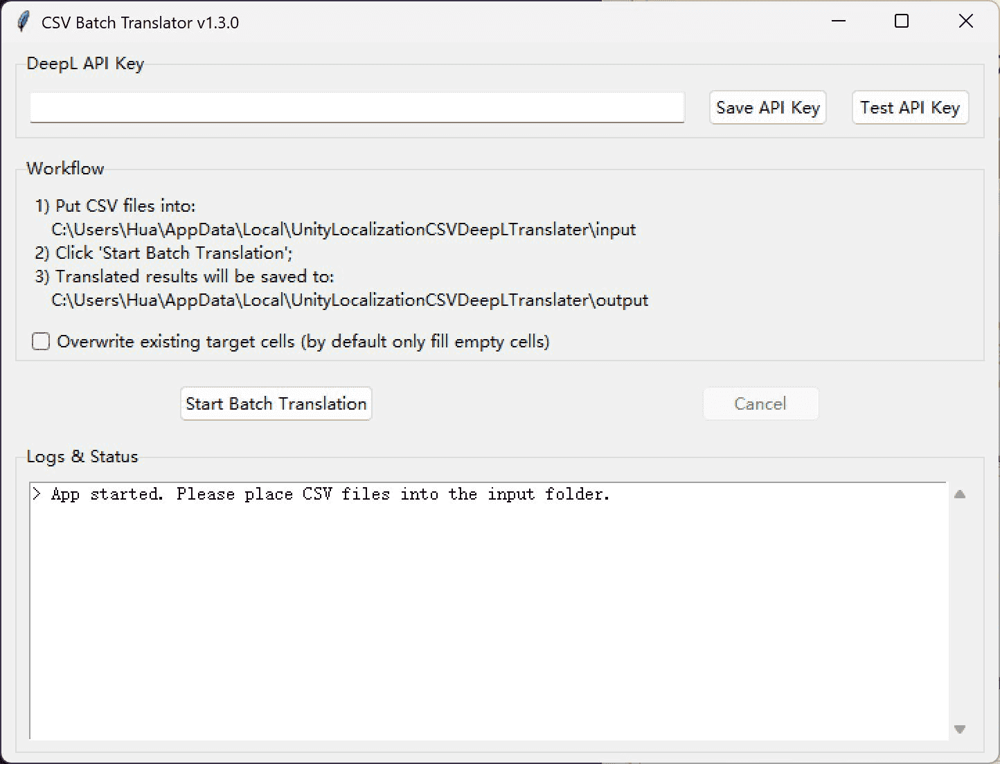

# CSV 批量翻译工具 (CSV Translator)

[English Version](#-english-version)

这是一个使用 Python 和 DeepL API 开发的桌面小工具，**专为翻译 Unity Localization 插件导出的 CSV 表格而设计**。当前版本固定以 `English(en)` 为源语言，并批量填充 CSV 中自动检测到的受支持目标语言列。

Use deepL API to translate CSV table that outputed from Unity Localization.



---

### 👋 首次发布说明

你好！我是**老白**，一名游戏开发者。这是我第一次公开发布个人项目，主要目的是为了方便自己和同样有需求的朋友。

项目中可能存在一些未被发现的 Bug 或疏漏之处，非常欢迎你通过 [Issues](https://github.com/siyan12/UnityLocalizationCSVDeepLTranslater/issues) 提出反馈和建议，帮助我把这个小工具做得更好！

-   **工作室**: LauNewBee
-   **我的作品**: [欢迎访问我的 Steam 开发者页面](https://store.steampowered.com/developer/LauNewBee)

---

## ✨ 功能特性

-   **已测试的 Unity 兼容性**：CSV 层面的自动测试覆盖 Unity Localization 1.4 文档中的标准 CSV 与 CSV (With Comments) 结构；限制见下文“Unity 兼容范围”。
-   **图形化界面**：简洁直观的图形界面，无需命令行操作。
-   **界面语言**：当前 GUI 仅提供英文界面；README 同时提供中文和英文说明。
-   **批量翻译**：固定从 `English(en)` 源列翻译，自动填充 CSV 中检测到的受支持目标列；当前没有源语言或目标语言选择器。DeepL 请求按保守的最多 50 条文本和安全请求体预算分批发送。
-   **任务内缓存**：同一次任务会跨文件复用相同源文本与目标语言的译文；缓存仅保存在内存中，任务结束即清除，不会把本地化内容持久化到磁盘。
-   **安全配置**：DeepL API Key 保存到操作系统凭据库，不写入项目或 `config.ini`。
-   **源码平台**：Python 3.10+ 源码面向 Windows、macOS 和 Linux，需要 Tkinter 与可用的系统凭据库后端。自动测试在 Windows 和 Linux 上运行；macOS 尚未纳入 CI 验证。
-   **预编译包平台**：从 v1.3.0 起，发布工作流将生成版本化的 Windows x64 EXE 和 SHA-256 校验文件；macOS 和 Linux 用户请从源码运行。

---

## 🚀 快速开始 (普通用户)

1.  **下载与校验**
    -   前往本项目的 [Releases 页面](https://github.com/siyan12/UnityLocalizationCSVDeepLTranslater/releases)。
    -   下载最新的 `CSVTranslator-vX.X.X-windows-x64.exe` 及同名 `.sha256` 文件，并按 Release 页面说明核对 SHA-256。
    -   Windows PowerShell 可运行 `Get-FileHash .\CSVTranslator-vX.X.X-windows-x64.exe -Algorithm SHA256`，将结果与 `.sha256` 文件中的哈希比较。

2.  **准备文件**
    -   首次启动后，界面会显示用户数据目录中的 `input` 和 `output` 完整路径。
    -   将从 Unity 导出的 `.csv` 文件放入该 `input` 文件夹。

3.  **运行与翻译**
    -   双击运行下载的版本化 EXE。
    -   在程序界面的 **API Key 输入框**中填入 Key，然后点击 **Save API Key**；Key 会保存到操作系统凭据库。
    -   当前版本固定从 `English(en)` 翻译，并自动填充文件中检测到的受支持目标语言列；点击“开始翻译”。
    -   程序会先显示本次任务的预计翻译字符数和目标语言数量；确认后才会调用 DeepL。
    -   运行中可点击“取消翻译”。已经完成的文件会保留；正在处理的文件不会提交新输出，也不会覆盖该文件以前成功生成的输出。
    -   翻译完成后，结果会保存在界面显示的 `output` 文件夹中。

---

## 📂 数据保存位置

程序不会依赖启动时的当前目录。Windows 数据目录默认为
`%LOCALAPPDATA%\UnityLocalizationCSVDeepLTranslater`；macOS 默认为
`~/Library/Application Support/UnityLocalizationCSVDeepLTranslater`；Linux 默认为
`$XDG_DATA_HOME/UnityLocalizationCSVDeepLTranslater`（未设置时使用
`~/.local/share/UnityLocalizationCSVDeepLTranslater`）。该目录只放 `input` 和
`output` CSV；API Key 不保存在其中。

---

## 🛠️ 从源码运行与构建

需要 Python 3.10 或更高版本。Linux 用户如果 Python 未包含 Tkinter，请先通过系统包管理器安装（例如 Debian/Ubuntu 的 `python3-tk`）。

```powershell
# Windows PowerShell
py -3 -m venv .venv
.\.venv\Scripts\Activate.ps1
python -m pip install --upgrade pip
python -m pip install ".[dev]"
python gui_app.py
```

```bash
# macOS / Linux
python3 -m venv .venv
source .venv/bin/activate
python -m pip install --upgrade pip
python -m pip install ".[dev]"
python gui_app.py
```

运行离线测试和语法检查：

```bash
python -m pytest
python -m py_compile translator_core.py gui_app.py app_storage.py app_version.py
```

使用 PyInstaller 构建当前平台的可执行文件：

```bash
python -m pip install ".[build]"
python -m PyInstaller --clean --noconfirm CSVTranslator.spec
```

构建结果位于 `dist` 目录。PyInstaller 不是交叉编译器；用于发布的 Windows 可执行文件应在 Windows 上构建并测试。

发布前还应运行不联网的公开示例 CSV 往返检查：

```bash
python scripts/offline_release_smoke.py
```

推送与 `app_version.py` 一致、且指向 `main` 历史的 `vX.Y.Z` tag 后，发布工作流会使用 `requirements-release.lock`、固定 Python 版本和固定 Action 提交重复上述检查，构建并自检 Windows EXE。`release` GitHub Environment 应配置必需审批人，并保存可选的 Authenticode 签名 secrets；未配置证书时产物不会声称已签名。工作流先创建草稿、上传并核对 EXE 与 `.sha256`；第二个受保护的发布 job 获批后才公开 Release，失败后可安全重跑。发布前按 [RELEASE_CHECKLIST.md](RELEASE_CHECKLIST.md) 完成人工验收。

锁文件用于从同一 tag 进行功能一致的重建；GitHub Windows runner 镜像、PE 元数据和 Authenticode 时间戳仍可能使不同时间构建的二进制哈希不同。发布的 `.sha256` 用于验证实际下载产物，不是跨构建可重复性承诺。

---

## ⚠️ 注意事项

-   **API Key**：Key 通过 Python `keyring` 保存到系统凭据库。请勿在日志、Issue、CSV 或配置文件中粘贴 Key。若怀疑泄露，请立即在 DeepL 账户中停用/删除该 Key 并创建新 Key；还可在系统的“凭据管理器/钥匙串”中删除服务名 `UnityLocalizationCSVDeepLTranslater` 的条目。
-   **旧版迁移**：新版本不会读取旧的 `CSVtranslator-run/config.ini`。请在新界面重新保存 Key，确认可用后安全删除旧文件；若旧文件曾被分享，必须轮换 Key。
-   **凭据库不可用**：程序会明确报错且不会退回明文保存。请确认已安装 `keyring`，并确保系统凭据服务可用。
-   **隐私**：待翻译的 CSV 文本会通过 DeepL SDK 发送给 DeepL，这是完成翻译所必需的唯一文本上传。工具本身不添加遥测或其他上传渠道，UI 日志也不会显示源文或译文内容。
-   **费用**：DeepL API 的免费额度有限，请注意使用量，避免产生不必要的费用。
-   **批量请求**：待翻译文本按保守的最多 50 条一批提交，并同时遵守安全请求体预算，避免大请求接近服务限制。
-   **任务内缓存**：相同的源文本/目标语言组合会在同一次任务的不同文件间复用，减少重复请求。缓存只存在于内存，任务结束即丢弃；为避免本地化内容泄露，当前不实现持久缓存。
-   **用量确认与取消**：调用 DeepL 前会显示预计翻译字符数和目标语言数量并要求确认。取消会保留已完成文件；当前文件的临时结果会被丢弃，不提交新输出，也不覆盖旧输出。
-   **CSV 格式**：文件必须是带或不带 UTF-8 BOM 的 UTF-8 CSV，包含 `Key` 或 `Id` 标识列、固定源列 `English(en)`，以及至少一个受支持的目标语言列。每行必须有非空 `Key` 或正数 `Id`；新条目可在有 `Key` 时将 `Id` 留空或设为 `0`。空/重复表头、字段数量异常、重复的非空 Key/已分配 Id 和已知但不支持的标准语言列会在调用 DeepL 前以文件级错误拒绝；不会生成该文件的输出。
-   **支持的目标列**：`Chinese (Simplified)(zh)`、`Chinese (Traditional)(zh-Hant)`、`French(fr)`、`German(de)`、`Japanese(ja)`、`Korean(ko)`、`Polish(pl)`、`Portuguese(pt)`、`Russian(ru)`、`Spanish(es)`、`Turkish(tr)`。评论列与自定义元数据列会原样保留，不会送去翻译。
-   **往返保证**：保留输入是否含 UTF-8 BOM、表头和列顺序、逻辑行顺序，以及字段中的逗号、双引号和多行文本。输出采用标准 CSV 最小引号规则，因此不承诺与输入逐字节相同。
-   **安全输出**：每个 CSV 先写入输出目录中的专用临时文件，完成刷新并关闭后才原子替换最终文件。读取、翻译或写入失败不会覆盖上一次成功输出，正常中断也会清理临时文件。
-   **结果状态**：`success` 表示文件全部成功；`partial` 表示至少一个单元格成功、同时有失败单元格，失败格保留原值；`failed` 表示文件没有可提交的成功译文或发生文件级错误，因此不提交新输出。批次混合这些结果时，界面会明确显示部分完成。
-   **失败清单**：日志会列出失败单元格的文件名、CSV 行号、目标列、目标语言和安全错误信息，不包含源文、译文或 API Key，便于定位并重试。
-   **Unity 兼容范围**：已测试兼容 Unity Localization 1.4 文档给出的 `Key,Id,Locale...` 与 CSV (With Comments) CSV 结构，并支持仅含 `Key` 或 `Id` 的合法变体。这是自动 CSV 级测试，不代表所有 Unity Editor/包版本都已端到端验证。已知限制：源列固定为 `English(en)`；自定义 Locale Field Name 无法自动识别为语言列；其他 Unity Localization 版本尚未在 Unity Editor 中做端到端验证。自定义非语言列会原样保留。
-   **结构保护**：工具会保留 .NET/Python/printf 占位符、Unity Smart String、ICU、富文本标签与换行；如果译文结构不同，该单元格会保留原值并报告失败。当前嵌套 Smart String/ICU 会整段保护，因此表达式内部的分支文案不会翻译。
-   **重试与错误分类**：网络暂时故障、DeepL 服务器错误和限流由官方 DeepL SDK 按指数退避自动重试，应用不会叠加第二层重试或在最终失败后继续休眠。认证、请求参数和额度错误不会重试，并会停止批次；界面显示不含源文或密钥的可操作提示。

## 🧪 离线测试

安装开发依赖后运行 `python -m pytest`。测试使用 fake DeepL client，并由自动 fixture
禁止网络连接，不会调用真实或计费 API。

## 🔐 贡献时的凭据检查

仓库的 GitHub Actions 会拒绝被跟踪的 `config.ini` 和疑似凭据。贡献者也可安装
`pre-commit` 后运行 `pre-commit install` 启用同一项提交前检查，或手动运行
`python scripts/check_secrets.py`。检查只报告文件名和规则名，不输出疑似密钥。

## 📄 许可证

本项目使用 [MIT License](LICENSE)。

---
---

# 🇬🇧 English Version

This is a desktop tool developed with Python and the DeepL API, **specifically designed for translating CSV files exported from the Unity Localization package**. The current version always uses `English(en)` as its source and batch-fills the supported target-language columns detected in each CSV.

Use deepL API to translate CSV table that outputed from Unity Localization.


---

### 👋 First Release Note

Hi there! I'm **Lao Bai**, a game developer. This is the first personal project I've ever released publicly. My main goal was to create a handy tool for myself and other developers with similar needs.

There might be some undiscovered bugs or oversights. I would be very grateful if you could provide feedback and suggestions via the [Issues](https://github.com/siyan12/UnityLocalizationCSVDeepLTranslater/issues) page to help me improve it!

-   **Studio**: LauNewBee
-   **My Work**: [Check out my Steam Developer Page](https://store.steampowered.com/developer/LauNewBee)

---

## ✨ Features

-   **Tested Unity Compatibility**: CSV-level automated tests cover the standard CSV and CSV (With Comments) layouts documented for Unity Localization 1.4; see **Unity compatibility scope** below for limitations.
-   **GUI**: Simple and intuitive graphical user interface, no command line needed.
-   **UI Language**: The current GUI is English-only; this README provides both Chinese and English instructions.
-   **Batch Translation**: Always translate from the `English(en)` source column and automatically fill supported target columns detected in the CSV; there is currently no source- or target-language selector. DeepL requests are split conservatively by both a maximum of 50 texts and a safe request-body budget.
-   **Task-local Cache**: Reuse translations for the same source-text/target-language pair across files in one task. The cache is memory-only, cleared when the task ends, and never persists localization content to disk.
-   **Secure Configuration**: The DeepL API Key is stored in the operating system credential store, never in the project or `config.ini`.
-   **Source Platforms**: The Python 3.10+ source targets Windows, macOS, and Linux with Tkinter and a working system credential-store backend. Automated tests run on Windows and Linux; macOS is not currently covered by CI.
-   **Prebuilt Package Platforms**: Starting with v1.3.0, the release workflow will produce a versioned Windows x64 executable and SHA-256 checksum; macOS and Linux users should run from source.

---

## 🚀 Quick Start (For Users)

1.  **Download and Verify**
    -   Go to the [Releases page](https://github.com/siyan12/UnityLocalizationCSVDeepLTranslater/releases) of this project.
    -   Download the latest `CSVTranslator-vX.X.X-windows-x64.exe` and its matching `.sha256` file, then verify SHA-256 as described on the Release page.
    -   In Windows PowerShell, run `Get-FileHash .\CSVTranslator-vX.X.X-windows-x64.exe -Algorithm SHA256` and compare it with the hash in the `.sha256` file.

2.  **Prepare Files**
    -   After the first launch, the UI displays the full paths of the `input` and `output` folders in the user data directory.
    -   Place the `.csv` file exported from Unity into that `input` folder.

3.  **Run and Translate**
    -   Double-click the downloaded versioned executable.
    -   Enter your DeepL API Key in the UI and click **Save API Key**. It is saved in the operating system credential store.
    -   This version always translates from `English(en)` and automatically fills the supported target-language columns detected in the file. Click "Start Translation."
    -   The application first shows the estimated number of characters to translate and the number of target languages. DeepL is called only after you confirm.
    -   You can click **Cancel Translation** while the task is running. Completed files are kept; the file currently being processed does not commit a new output or overwrite its last successful output.
    -   The translated file will be saved in the `output` folder shown in the UI.

---

## 📂 Data Locations

The application does not depend on its launch working directory. The default data
directory is `%LOCALAPPDATA%\UnityLocalizationCSVDeepLTranslater` on Windows,
`~/Library/Application Support/UnityLocalizationCSVDeepLTranslater` on macOS, and
`$XDG_DATA_HOME/UnityLocalizationCSVDeepLTranslater` on Linux (falling back to
`~/.local/share/UnityLocalizationCSVDeepLTranslater`). It contains only the `input`
and `output` CSV folders; the API Key is not stored there.

---

## 🛠️ Run from Source and Build

Python 3.10 or newer is required. If a Linux Python installation does not include
Tkinter, install it first with the system package manager (for example,
`python3-tk` on Debian/Ubuntu).

```powershell
# Windows PowerShell
py -3 -m venv .venv
.\.venv\Scripts\Activate.ps1
python -m pip install --upgrade pip
python -m pip install ".[dev]"
python gui_app.py
```

```bash
# macOS / Linux
python3 -m venv .venv
source .venv/bin/activate
python -m pip install --upgrade pip
python -m pip install ".[dev]"
python gui_app.py
```

Run the offline tests and syntax checks:

```bash
python -m pytest
python -m py_compile translator_core.py gui_app.py app_storage.py app_version.py
```

Build an executable for the current platform with PyInstaller:

```bash
python -m pip install ".[build]"
python -m PyInstaller --clean --noconfirm CSVTranslator.spec
```

The result is written to `dist`. PyInstaller is not a cross-compiler; build and test
a release Windows executable on Windows.

Before release, also run the public sample CSV round-trip check, which never contacts DeepL:

```bash
python scripts/offline_release_smoke.py
```

Pushing a `vX.Y.Z` tag that matches `app_version.py` and belongs to `main` makes the release workflow repeat these checks with `requirements-release.lock`, a pinned Python version, and Actions pinned to exact commits, then build and runtime-check the Windows executable. The `release` GitHub Environment should require reviewers and hold the optional Authenticode signing secrets; an unsigned build is never presented as signed. The workflow creates a draft first and verifies both the EXE and `.sha256`; a second protected publish job makes it public only after approval, so a failed run can be resumed safely. Complete [RELEASE_CHECKLIST.md](RELEASE_CHECKLIST.md) before publishing.

The lock file supports a functionally equivalent rebuild from the same tag. Updates to the hosted Windows runner, PE metadata, and Authenticode timestamps may still produce different binary hashes across build dates. The published `.sha256` verifies the actual download; it is not a promise of bit-for-bit reproducibility across separate builds.

---

## ⚠️ Important Notes

-   **API Key**: The Key is stored through Python `keyring` in the system credential store. Never paste it into logs, issues, CSV files, or configuration files. If exposure is suspected, disable/delete it in your DeepL account immediately and create a replacement. You may also remove the entry named `UnityLocalizationCSVDeepLTranslater` from the OS Credential Manager/Keychain.
-   **Legacy migration**: New versions do not read the old `CSVtranslator-run/config.ini`. Save the Key again in the new UI, verify it, and then securely delete the old file. Rotate the Key if that file was ever shared.
-   **Unavailable credential store**: The application reports an error and never falls back to plaintext. Ensure `keyring` is installed and the OS credential service is available.
-   **Privacy**: CSV text selected for translation is sent to DeepL through the DeepL SDK; this is the only text upload required to perform translation. The tool adds no telemetry or other upload channel, and the UI log does not display source or translated text.
-   **Costs**: The DeepL API has a limited free tier. Be mindful of your usage to avoid unexpected charges.
-   **Batched requests**: Texts are submitted conservatively in batches of at most 50 while also respecting a safe request-body budget, so large requests do not approach provider limits.
-   **Task-local cache**: The same source-text/target-language pair is reused across files within one task, reducing duplicate requests. The cache exists only in memory and is discarded when the task ends; persistent caching is currently not implemented to avoid leaking localization content.
-   **Usage confirmation and cancellation**: Before calling DeepL, the application shows the estimated character count and target-language count and asks for confirmation. Cancellation keeps completed files, discards temporary results for the current file, commits no new output for it, and does not overwrite an older output.
-   **CSV Format**: Files must be UTF-8 CSV, with or without a UTF-8 BOM, and contain a `Key` or `Id` identity column, the fixed `English(en)` source column, and at least one supported target-language column. Every row needs a non-empty `Key` or a positive `Id`; new entries may use an empty or zero `Id` when a `Key` is present. Empty or duplicate headers, inconsistent field counts, duplicate non-empty Keys/assigned Ids, and known unsupported standard language columns are rejected with a file-level error before DeepL is called; no output is produced for that file.
-   **Supported target columns**: `Chinese (Simplified)(zh)`, `Chinese (Traditional)(zh-Hant)`, `French(fr)`, `German(de)`, `Japanese(ja)`, `Korean(ko)`, `Polish(pl)`, `Portuguese(pt)`, `Russian(ru)`, `Spanish(es)`, and `Turkish(tr)`. Comment and custom metadata columns are preserved and are not sent for translation.
-   **Round-trip guarantees**: The tool preserves the input BOM state, header and column order, logical row order, and commas, double quotes, and multiline text inside fields. Output uses standard minimal CSV quoting, so byte-for-byte identity is not promised.
-   **Safe output**: Each CSV is written to a dedicated temporary file in the output directory, flushed, closed, and only then atomically replaces the destination. Read, translation, or write failures never overwrite the last successful output, and orderly interruption cleans up the temporary file.
-   **Result states**: `success` means the file completed without cell failures; `partial` means at least one cell succeeded while failed cells retained their original values; `failed` means there was no successful translation to commit or a file-level error occurred, so no new output is committed. Mixed batches are clearly shown as partially complete in the UI.
-   **Failure list**: The log identifies failed cells by filename, CSV row, target column, target language, and a safe error message. It never includes source text, translated text, or the API Key, making failures safe to locate and retry.
-   **Unity compatibility scope**: Tested compatibility covers the `Key,Id,Locale...` and CSV (With Comments) CSV structures documented for Unity Localization 1.4, including valid variants with only `Key` or `Id`. This is automated CSV-level testing, not end-to-end verification of every Unity Editor/package version. Known limitations: the source column is fixed to `English(en)`; custom Locale Field Names cannot be detected automatically as language columns; and other Unity Localization versions have not been verified end-to-end in the Unity Editor. Custom non-language columns are preserved unchanged.
-   **Structure protection**: The tool preserves .NET/Python/printf placeholders, Unity Smart Strings, ICU expressions, rich-text tags, and line breaks. If translated structure differs, the original target cell is kept and the failure is reported. Nested Smart String/ICU expressions are currently protected as a whole, so branch text inside them is not translated.
-   **Retries and error categories**: The official DeepL SDK retries temporary network failures, server errors, and rate limits with exponential backoff. The app does not add another retry layer or sleep after the terminal failure. Authentication, invalid-request, and quota errors are not retried and stop the batch; the UI shows an actionable message without source text or credentials.

## 🧪 Offline Tests

Install the development dependencies and run `python -m pytest`. Tests use a fake
DeepL client, and an automatic fixture blocks network connections, so no real or
billable API is called.

## 🔐 Credential Checks for Contributors

GitHub Actions rejects tracked `config.ini` files and likely credentials. Contributors
can install `pre-commit` and run `pre-commit install` for the same check before each
commit, or run `python scripts/check_secrets.py` manually. The scanner reports only
the file and rule names, never the suspected secret value.

## 📄 License

This project is licensed under the [MIT License](LICENSE).
